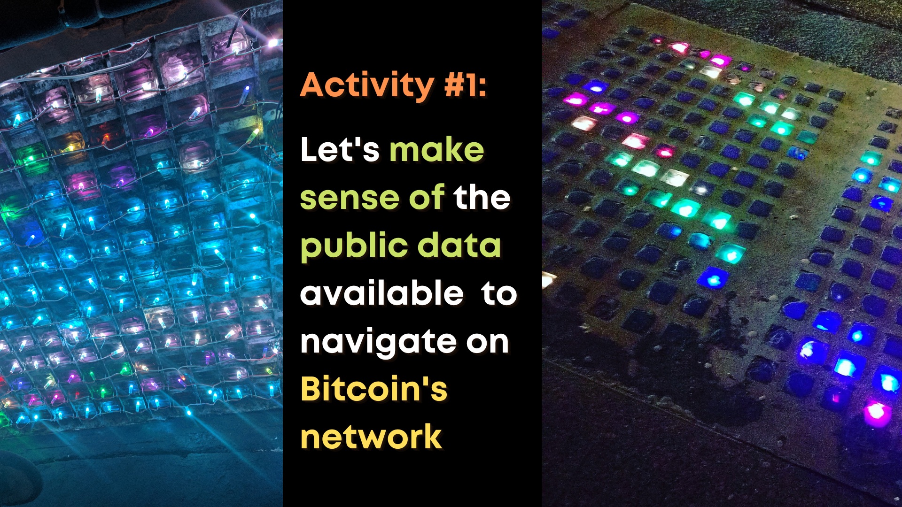
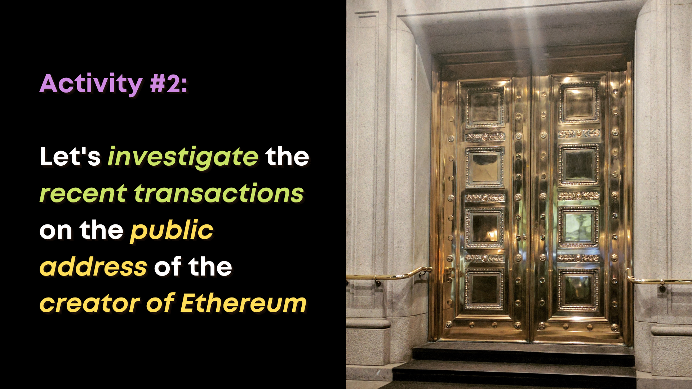

# Activity 1: Explore Bitcoin's Mempool

 

Please navigate with me to [Johoe's Bitcoin Mempool Statistics](https://jochen-hoenicke.de/queue/#0,24h).

**Bonus**: A different [mempool virtualization site](https://mempool.space/), and a more utilitarian presentation of [fee size related to transaction confirmation times](https://bitcoinfees.earn.com/#delay).

# Activity 2: Review Activity from a Known Ethereum Addresss

 

[Vitalik Buterin](https://en.wikipedia.org/wiki/Vitalik_Buterin), wunderkind inventor of the Ethereum *world computer* idea, shared one of his major public ETH wallet addresses [here in 2018](https://twitter.com/VitalikButerin/status/1050126908589887488).

[This is that address on the public blockchain explorer Etherscan](https://etherscan.io/address/0xab5801a7d398351b8be11c439e05c5b3259aec9b). 

However, *perfectly* in line with our workshop focus, the major explorer Etherscan was *down* when polishing this workshop day-of, so let's explore how we deal with that by finding an alternate public blockchain explorer (e.g. [Etherchain](https://etherchain.org/), [Ethplorer](https://ethplorer.io/)) and manually searching for Vitalik's address, 0xab5801a7d398351b8be11c439e05c5b3259aec9b.