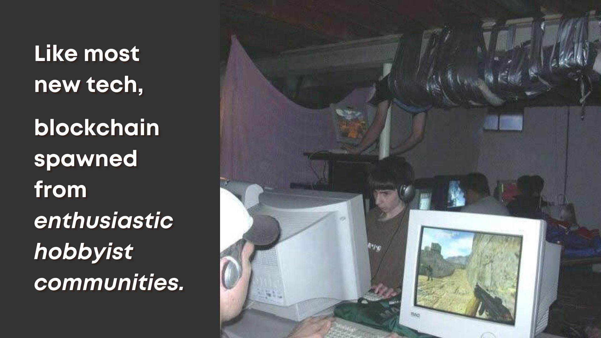
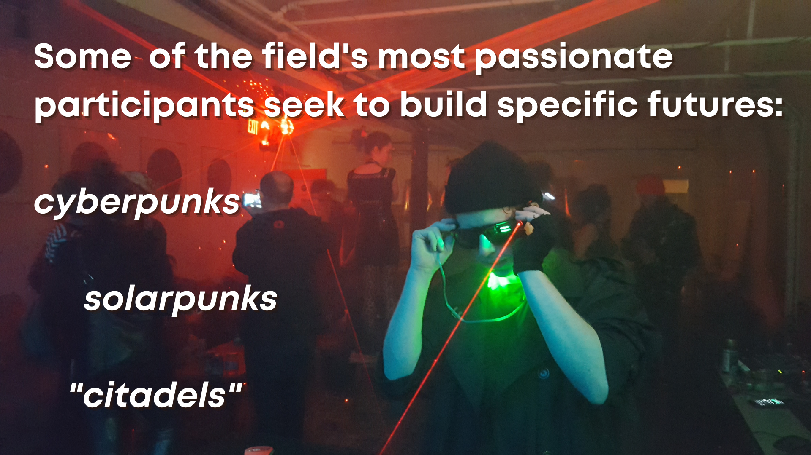
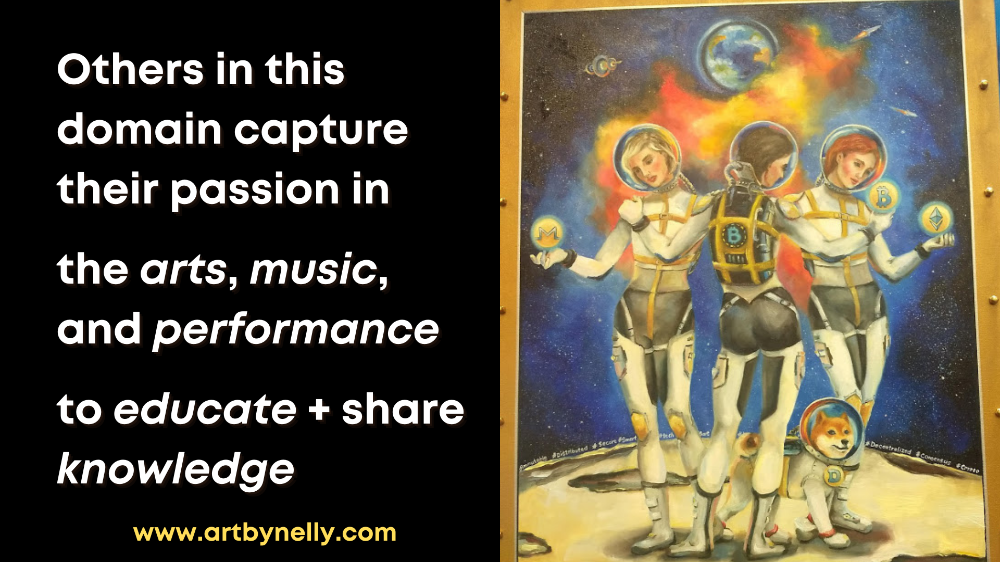

# Spawned by Passionate Hobbyists

 

* Despite major investment firms moving huge sums in cryptocurrency, this is still early enough to be a community space

* Think of the past twelve years of your life. That's how long Bitcoin has been in existence, and most of its community solidified less than eight years ago

* Despite being about "trustlessness" this means the space is all about relationships and reputation

# Self-Selecting for Ideologies

 

* Despite being such a small population of enthusiasts, the blockchain & decentralization space has further self-selecting ideological groups

* Currently looking for a more thoughtful/less exploitative term than "tribes" for this

* Example: [Artemij Voskobojnikov's UBC-based research](https://lersse.ece.ubc.ca/2020/03/03/lersse-at-financial-cryptography-2020/) in this space - self-perception of different "generations" of cryptocurrency entrants

# Beyond Just Technology

 

# Spanning the Human Arts

 

* Transition point: why we covered all these communities? Research ethics particular to an emerging field