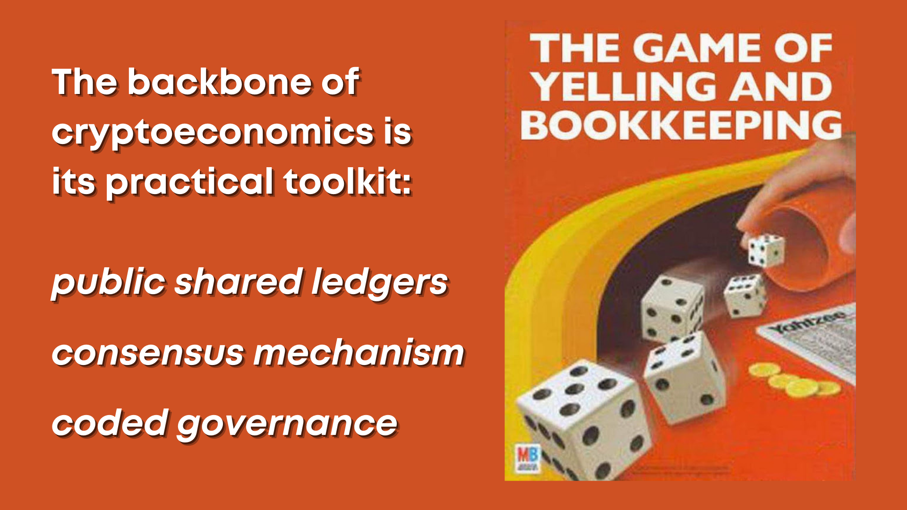

# Contextualizing Cryptoeconomics

 

* Defining [cryptoeconomics](https://en.wikiversity.org/wiki/Cryptoeconomics)

* Key concepts: 
    * **append-only** (*immutable*)
    * **peer to peer** (*verifiable*)
    * **uncensorable** (*self-sovereign*)

Brings in elements of:

* Computer science and cryptography
* Complex distributed systems engineering
* Archival and information science
* Economics and game theory

# Glossary

**Address**

**Altcoins**

**Antifragility**

**Bitcoin**

**[Blockchain]**(https://en.bitcoin.it/wiki/Block_chain) is a type of data structure which is *simple for anyone to verify* and *difficult for anyone to intentionally change*.
*  a literal **chain** of **data blocks**.

**Consensus Algorithms**

**Custodial**

**Cryptocurrency**

**Cryptoeconomics**

**Cypherpunks**

**Decentralization**

**Decentralized Autonomous Organizations (DAOs)**

**DeFi**

**Ethereum**

**Fork(ing)**

**Immutability**

**Layer 2**

**Lightning Network**

**Node**

**Opt In Privacy**

**Proof of Work** is the *consensus algorithm* utilized by Bitcoin, which utilizes [competitive computing power](https://medium.com/certik/how-bitcoin-works-mining-and-consensus-3d64bf893ba2) from voluntary participants to secure the network.
* many computers across the world validate transactions transparently by doing complex math problems- *proving their work*.

**Pseudonymity**

**Seed Phrase/Key**

**Self Sovereign**

**Solidity**

**Smart Contracts**

**Sybil Attack**

**Timestamping**

**Trustlessness**

**Wallet**

**Voluntaryism**