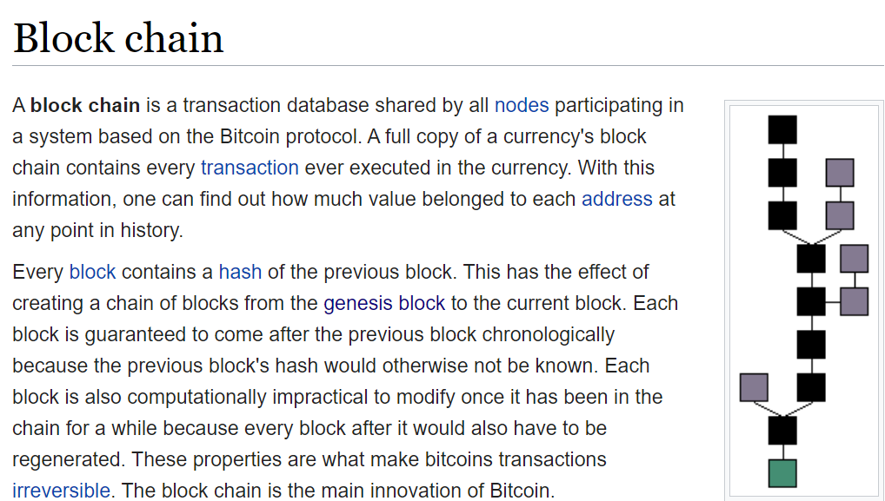
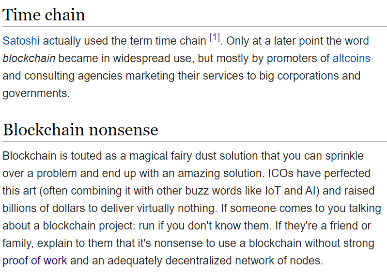

# What Do We Mean By Blockchain?

 

* At its base, "[blockchain](https://en.bitcoin.it/wiki/Block_chain)" simply refers to a type of data structure which is *simple for anyone to verify* and *difficult for anyone to change*.

Screenshot from [Bitcoin Wiki](https://en.bitcoin.it/wiki/Block_chain), CC-A 3.0

* Usually, when people *say* blockchain, they're referring more generally to the ledgers, cryptocurrencies, or decentralized consensus mechanisms being used in blockchain systems.

* People use the word "blockchain" very imprecisely. To account for that, we'll be touching briefly upon many of the important elements of these decentralized technology systems in this session.

# Origins: The 2008 Bitcoin Whitepaper

 

* Satoshi Nakamoto's Bitcoin whitepaper: launching the toolkit for cryptoeconomics

    * A chain of immutable, timestamped data blocks which build upon one another (*timechain*)
    * Competitive use of computing power (*Proof of Work*) to secure the network- many computers across the world confirm transactions, rather than a centralized authority
    * An [antifragile](https://en.wikipedia.org/wiki/Antifragile#Introduction) distributed consensus-based network system (e.g. [resistant to Sybil attacks](https://en.wikipedia.org/wiki/Sybil_attack))

# Bitcoin: A Success Story, Slow Then Fast

 

* The snowball effect of community adoption: inventing value "out of thin air" (e.g. Laszlo Hanyecz's [Bitcoin Pizza](https://www.coindesk.com/bitcoin-pizza-10-years-laszlo-hanyecz))

* After Bitcoin adoption began to pick up, *people wanted to copy its success*:  this led to the age of "altcoins" (which began by simply *forking* Bitcoin, or copying its codebase)

At this point, we must return to the "Block Chain" page of the original Bitcoin Wiki, which we pulled our definition from above:

Screenshot from [Bitcoin Wiki](https://en.bitcoin.it/wiki/Block_chain), CC-A 3.0

* Excited developers wanted to see peer-to-peer technology go beyond *money* - the next major movements came with the creation of Ethereum

# What About "Decentralization"?

 

[Why Decentralization Matters](https://onezero.medium.com/why-decentralization-matters-5e3f79f7638e): 'Coding In' decentralization as an attempt to reclaim the promise of the open World Wide Web (e.g. [Decentralized Web Summit](https://www.decentralizedweb.net/about/))

 