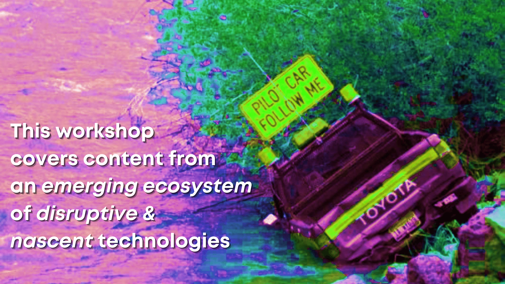
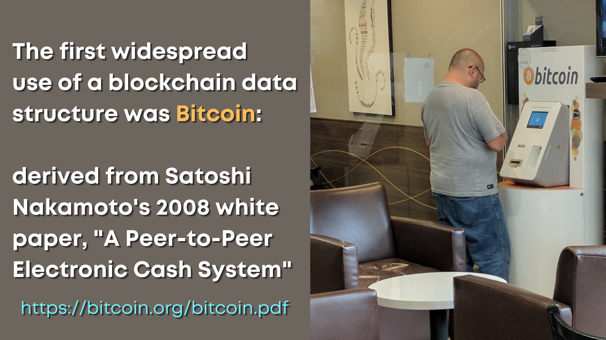
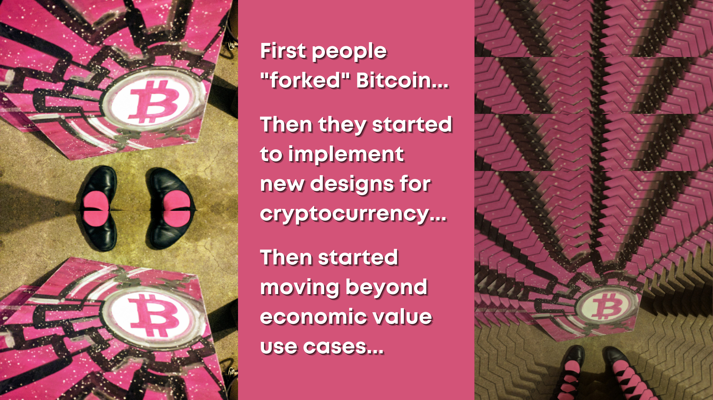
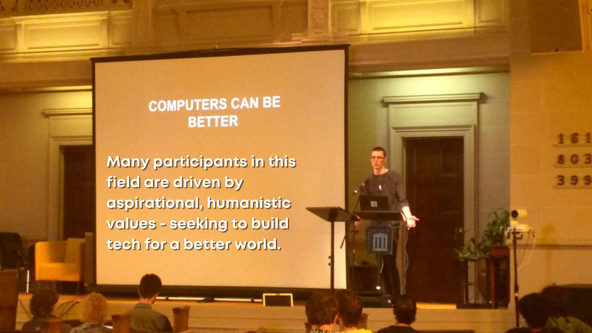

# Foundational Blockchain Concepts

 

* What is a blockchain?

* What do people usually mean when they say "blockchain"?

* Key concepts: **append-only** (*immutable*), **peer to peer** (*verifiable*), **uncensorable** (*self-sovereign*)

# Origins: The 2008 Bitcoin Whitepaper

 

* "Chancellor on Brink of Second Bailout for Banks" - the [Genesis Block](https://en.bitcoin.it/wiki/Genesis_block) of Bitcoin

* Satoshi Nakamoto's whitepaper: bringing together the toolkit for cryptoeconomics

    * Chain of immutable, timestamped data blocks which build upon one another (*timechain*)
    * Competitive use of computing power (*Proof of Work*)
    * An [antifragile](https://en.wikipedia.org/wiki/Antifragile#Introduction) system (e.g. [resistant to Sybil attacks](https://en.wikipedia.org/wiki/Sybil_attack))

* The snowball effect of community adoption: inventing value "out of thin air" (e.g. Laszlo Hanyecz's [Bitcoin Pizza](https://www.coindesk.com/bitcoin-pizza-10-years-laszlo-hanyecz))

# Beyond Bitcoin: Forks, Spoons, Moons

 

* After Bitcoin adoption began to pick up, *people wanted to copy its success*

* Beyond just superficial means: excited developers wanted to see peer-to-peer technology go beyond *money*

* There have been major splits in chains and communities (*forks*), the rare attempt to merge them back together (*spoons*), and overall, an increasing focus (maybe even obsession?) with 'price gains' AKA "going to the moon!"

# Idealistic Values Still Thrive

 

* Despite the increasing widespread adoption of *cryptocurrency* for financial speculation, the core engineers, developers and activists in the blockchain space are still anchored by a passion for social change

* Many participants are enthusiastically rooted in sci-fi utopian dreams for a future which is more open, more equitable, and more fair for all humans

* Example to explore: Jaya Klara Brekke's [Satoshi's Oath for Developers](https://blog.b9lab.com/proposing-the-satoshi-oath-for-developers-69003cffb022)