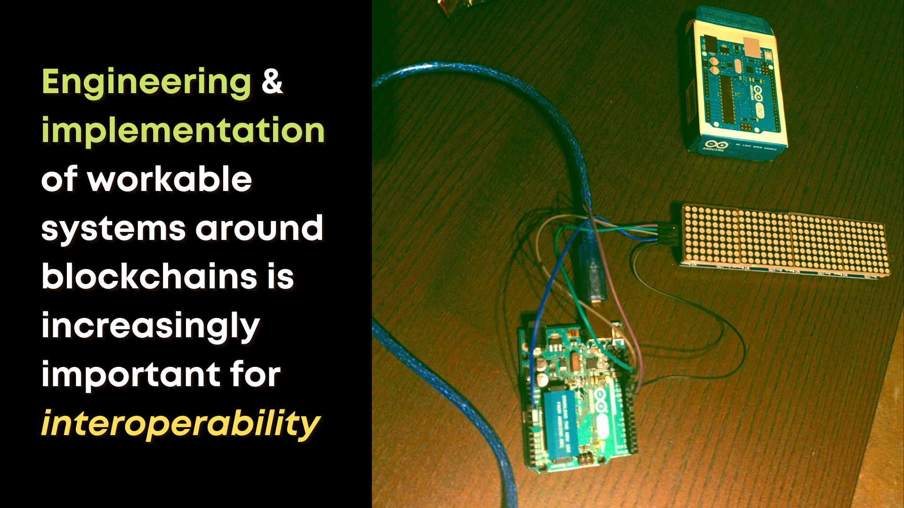

# Research in Computer Science and Programming

 

# Research in Engineering and Complex Systems Design

 

# Setting Legal and Regulatory Precedents and Policies

 

# Research in UX/UI and Creative Design

 

# Community Research, Advocacy, and Ethics

 