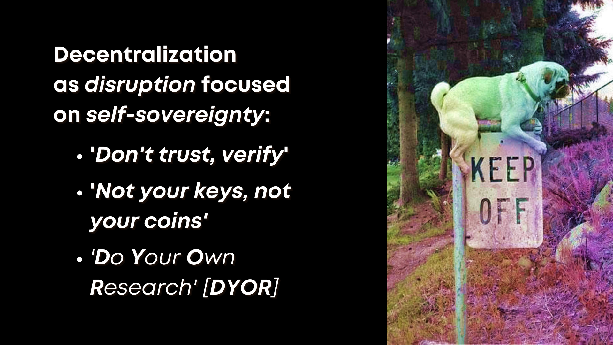

# The Multidisciplinarity of Blockchain Studies

### First let's revisit and review the the originating disciplines which contribute to blockchain:

* Computer science and cryptography
* Complex distributed systems engineering
* Archival and information science
* Economics and game theory
* Anarchist and libertarian activism

# Blockchain Communities as Subcultures

 

This fast-paced, small-scale set of intertwining communities provides a veritable live lab for the many disciplines tied into cryptoeconomics.

### Keep in mind that their participants are *real people* just as much at risk of harm or exploitation as any other population you'd study. 

In each exemplar use case to follow, we'll touch more upon the particular risks and pain points that arise when researching, or even engaging, with the communities around disruptive technologies like blockchain.

# What About "Decentralization"?

 

### [Why Decentralization Matters](https://onezero.medium.com/why-decentralization-matters-5e3f79f7638e): 'Coding In' decentralization as an attempt to reclaim the promise of the open World Wide Web (e.g. [Decentralized Web Summit](https://www.decentralizedweb.net/about/))

 