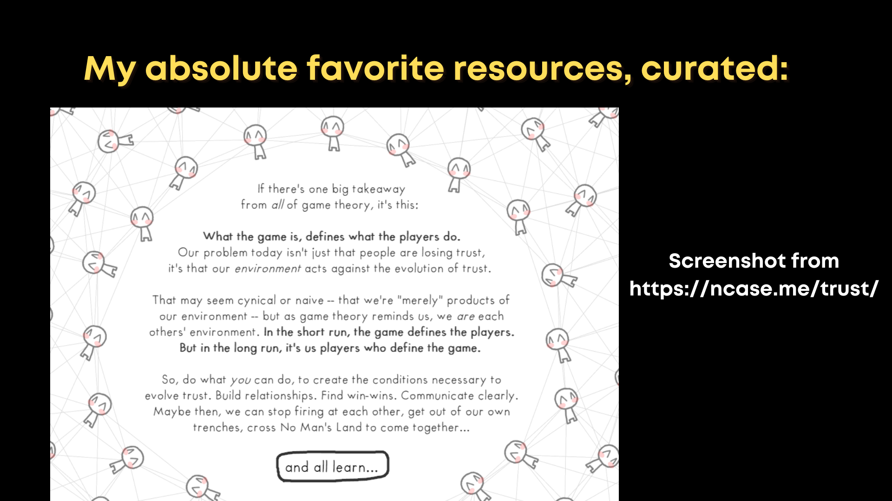
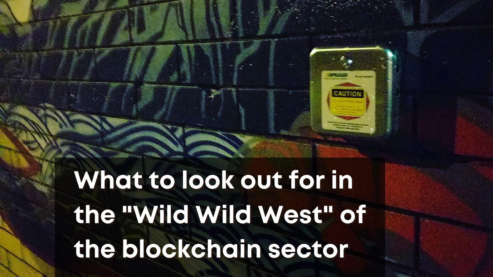
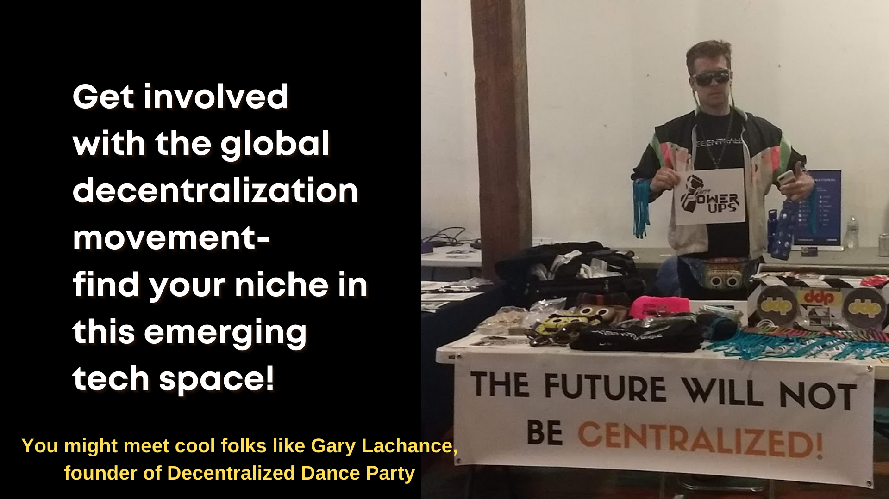

# Navigating and Evaluating Online Resources 

 

# Some Curated Resources to Get Started

 

Unsurprisingly, Bitcoin has the most 'established' sets of curated resources.

The [Bitcoin Wiki](https://en.bitcoin.it/wiki/Main_Page) was created in 2010. It's not updated a *ton* but it's a great starting point for all of the basics, especially very bite-sized core technical concepts.

[Jameson Lopp's Bitcoin Resources](https://www.lopp.net/bitcoin-information.html) is a much more all-encompassing site for exploration, and he maintains it as somewhat of a community project with additional resources frequently suggested through [the project's Github repository](https://github.com/jlopp/lopp.net/tree/master/bitcoin-information).

For Ethereum, [the project's home site learning section](https://ethereum.org/en/learn/) is a great place to start exploring.

From there, [ETHhub](https://docs.ethhub.io/) curates extensive learning resources from the community, and the [ethresear.ch forum](https://ethresear.ch/) presents deeper dives in the fringe of active research and development.

Ultimately, most projects *beyond* these two widely adopted public blockchains will present you their own "self-contained" resources and learning path (an indicator that, at this stage, many of them are still very *centralized*). As Bitcoin and Ethereum have a much broader surface of commentary and content production, I thought it would be most useful to provide specific curation regarding these blockchains. 

In part, the divisiveness of public blockchain perspectives comes from 

# 'Do Your Own Research' - Maintain Vigilance!

 

# Connect With Real People

 

* Though it's not as easy as 'walking into a meetup' anymore, there are many opportunities for free virtual learning online!

# Contribute to Global Movements

 