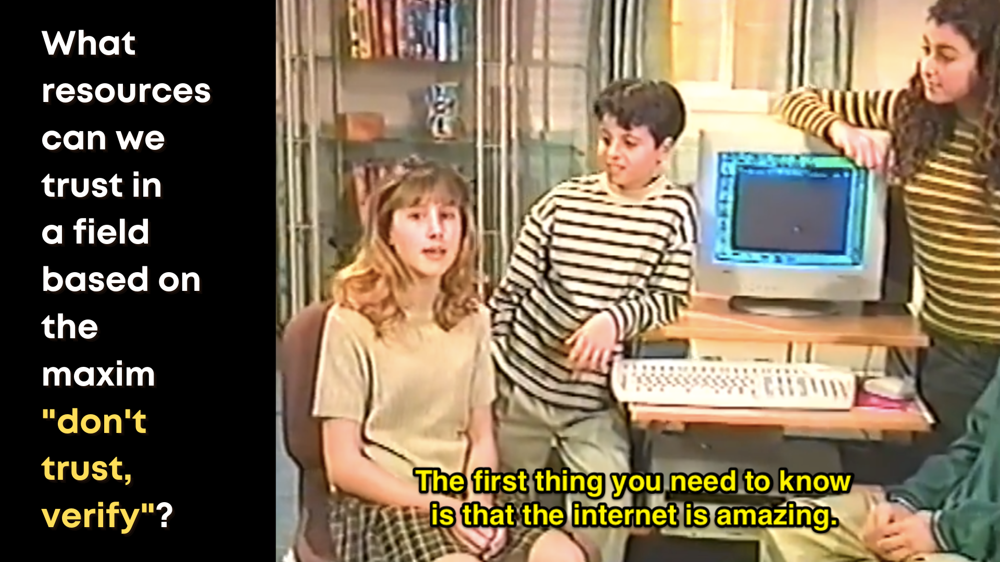
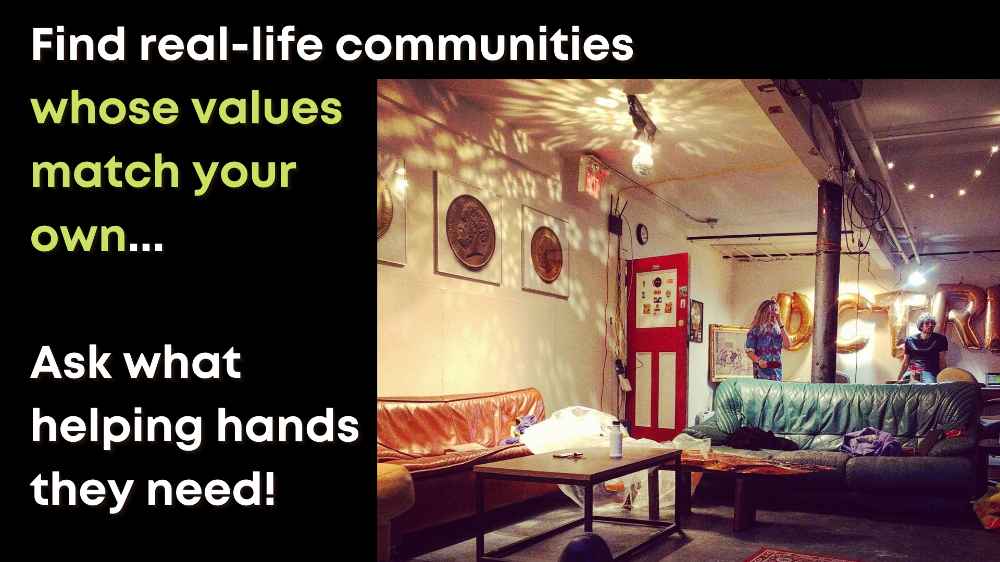

# Navigating/Evaluating Online Resources 

 

* Of course, you need the same digital literacy and critical evaluation skills that you use everyday as a student or researcher

* In addition, you should embrace some core maxims from this industry: "Do Your Own Research" and "Don't Trust, Verify"

* *How* to verify? Look for major sources ([Andreas Antonopoulos](https://aantonop.com/) is one of the original and the best) and voices to start following. That doesn't mean trust everything they say, of course, but start to curate the sources that make sense to you!

# Curated Resources to Get Started

 

Before diving into blockchain-specific resources, I'll share the best 'game theory' orientation I've ever found- [Nicky Case's ~30 min game 'The Evolution of Trust'](https://ncase.me/trust/).

Unsurprisingly, Bitcoin has the most 'established' sets of curated resources.

The [Bitcoin Wiki](https://en.bitcoin.it/wiki/Main_Page) was created in 2010. It's not updated a *ton* but it's a great starting point for all of the basics, especially very bite-sized core technical concepts.

[Jameson Lopp's Bitcoin Resources](https://www.lopp.net/bitcoin-information.html) is a much more all-encompassing site for exploration, and he maintains it as somewhat of a community project with additional resources frequently suggested through [the project's Github repository](https://github.com/jlopp/lopp.net/tree/master/bitcoin-information).

For Ethereum, [the project's home site learning section](https://ethereum.org/en/learn/) is a great place to start exploring.

From there, [ETHhub](https://docs.ethhub.io/) curates extensive learning resources from the community, and the [ethresear.ch forum](https://ethresear.ch/) presents deeper dives in the fringe of active research and development.

Ultimately, most projects *beyond* these two widely adopted public blockchains will present you their own "self-contained" resources and learning path (an indicator that, at this stage, many of them are still very *centralized*). As Bitcoin and Ethereum have a much broader surface of commentary and content production, I thought it would be most useful to provide specific curation regarding these blockchains. 

# 'DYOR' - Maintain Vigilance!

 

* This field overlaps with information security and 'hacking' along its many shades (e.g. white, gray, black hat hacking)

* Never provide your personal information to someone else, or "send someone cryptocurrency to receive more back." Anything that looks too good to be true, *definitely is*.

* "Social engineering" is one of the greatest attack vectors in this industry- e.g. make sure you bookmark links that you return to regularly, rather than using a search engine to track them down, as that can be temporarily "gamed" by scammers

# Connect With Real People

 

* Though it's not as easy as 'walking into a meetup' anymore, there are many opportunities for free virtual learning online!

* We run [UBC Bitcoin/Blockchain Club](https://amscampusbase.ubc.ca/bitcoinclub/club_signup) where new members are always welcome!

* Vancouver's prolific [blockchain meetup groups](https://www.meetup.com/Vancouver-Ethereum-Meetup/) are starting to produce some fully virtual events

# Contribute to Global Movements

 

* The blockchain and decentralization space is unfortunately still pretty homogeneous along many axes - we **need diverse voices and perspectives**

* In particular, we need to move beyond conceptions that this is just a "computer science" pursuit, or that programmers can somehow skip past thousands of years of lessons in human ethics and governance

* If you are interested in being a researcher-*practitioner*, (e.g. [Participatory Action Research](https://en.wikipedia.org/wiki/Participatory_action_research)) this is the ideal field to explore!