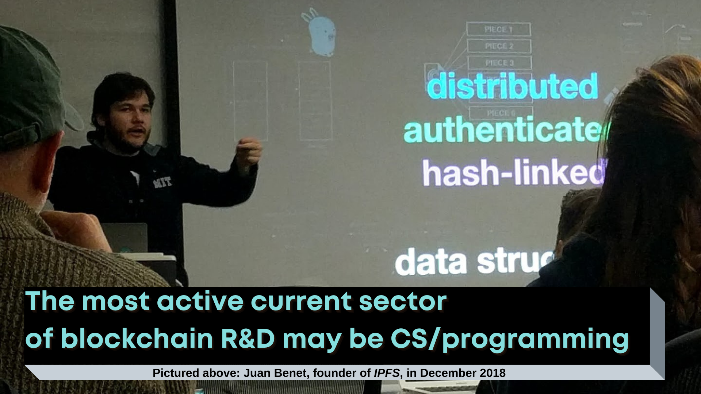
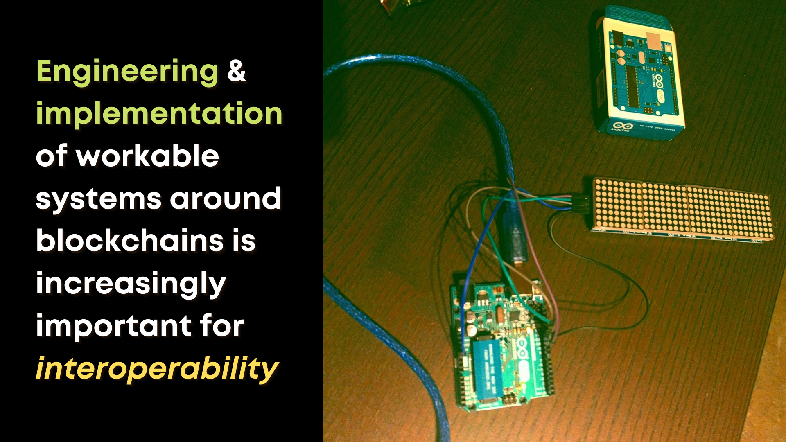
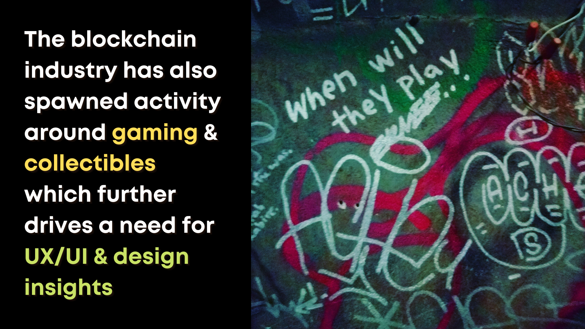

# Research Use Case: Coding Cryptoeconomic Experiments

 

### **Primary Focus**: How do theoretical concepts play out when implemented in real, self-executing computer code?

**Proximal Disciplines**: Computer Science, Economics, Finance, Behavioural Science, Philosophy

### **Example Research Questions**:

* Is it possible to add features from the Decentralized Finance ([DeFi](https://www.coindesk.com/what-is-defi)) space into the base smart contract for Non-Fungible Tokens?
    * See [this related paper](https://www.imperial.ac.uk/media/imperial-college/faculty-of-engineering/computing/public/1920-ug-projects/distinguished-projects/NFT.-finance-Leveraging-Non-Fungible-Tokens.pdf)
* Can we design smart contracts which meaningfully interoperate with real-world objects and assets?
    * See [this related paper](http://orca.cf.ac.uk/139348/)

**Major Concepts in Play**: [Permissionlessness](https://www.corda.net/blog/permissionlessness-a-simple-concept-with-profound-implications/), ["Code is Law"](https://www.lexology.com/library/detail.aspx?g=74540439-63f6-453e-a777-aabb56116081), [Game Theory](https://ncase.me/trust/), [Smart Contracts](https://ethereum.org/en/developers/docs/smart-contracts/)

### **Risks to Consider**:

* Can what I'm designing actively harm anyone, even subtly, in its current implementation?
* Could what I'm designing be *adapted* into a system that could cause harm?

**Example Project**: As linked above, there are current research implementations of non-fungible token smart contracts on Ethereum in pursuit of both ["DeFi" integration](https://www.imperial.ac.uk/media/imperial-college/faculty-of-engineering/computing/public/1920-ug-projects/distinguished-projects/NFT.-finance-Leveraging-Non-Fungible-Tokens.pdf) and [real-world interoperability](http://orca.cf.ac.uk/139348/)

# Research Use Case: Complex Systems Design

 

### **Primary Focus**: How do we ensure the engineering, implementation, and deployment of blockchain-proximal systems maintains a balance of security, scalability, and decentralization?

**Proximal Disciplines**: Engineering, Computer Science, Operations, DevOps

### **Example Research Questions**:

* How might we implement a provable and traceable supply line system using blockchain?
    * See [this paper](https://ieeexplore-ieee-org.ezproxy.library.ubc.ca/abstract/document/8726739)
* What best practices can be set for access control and role definition in relation to smart contracts which hold large financial value?

**Major Concepts in Play**: [Privacy by Design](https://www.ipc.on.ca/wp-content/uploads/resources/7foundationalprinciples.pdf), [Security by Design](https://reciprocitylabs.com/resources/what-is-security-by-design/), [Governance](https://www.ourmachine.net/writing/byzantine-generalization-problem/), [OpSec](https://www.lopp.net/bitcoin-information/security.html)

### **Risks to Consider**:

* Are there ways for human actors to work *around* our system? (e.g. swapping out QR codes or packaging on physical products)
* Could this system be misused to monopolize an industry, extract personal information, or some other nefarious purpose after-the-fact?

**Example Project**: A supply chain traceability system [proposed at IEEE's IoT conference](https://ieeexplore-ieee-org.ezproxy.library.ubc.ca/abstract/document/8726739)

# Research Use Case: User Interface & Experience Design

 

### **Primary Focus**: How do we onboard those who need financial literacy and participation opportunities into [this complex technical ecosystem](https://uxdesign.cc/what-the-hell-is-going-on-with-the-ux-in-cryptocurrency-7262d2754713)? 

**Proximal Disciplines**: Design, Information Science, Computer Science, Engineering, Art

### **Example Research Questions**:

* How can we use opt-in biometrics to make mobile cryptocurrency wallets easier to use while maintaining their security?
* What method of manually recording someone's [seed phrase](https://en.bitcoin.it/wiki/Seed_phrase) could last for 40+ years without physically wearing away?

**Major Concepts in Play**: [User Centred Design](https://www.interaction-design.org/literature/topics/user-centered-design), [Game Theory](https://ncase.me/trust/), [Governance](https://www.ourmachine.net/writing/byzantine-generalization-problem/)

### **Risks to Consider**:

* Is what I'm designing easy enough for the average non-technical user to progress through?
* Is the use case I'm focusing on realistic and relevant to how people actually engage with these technologies?

**Example Project**: This classic [UX Design Case Study](https://medium.com/@ngqunzhao/breaking-down-bitcoin-a-ux-design-case-study-7fdefbe7e1b8) focuses on a bitcoin and cryptocurrency wallet redesign.